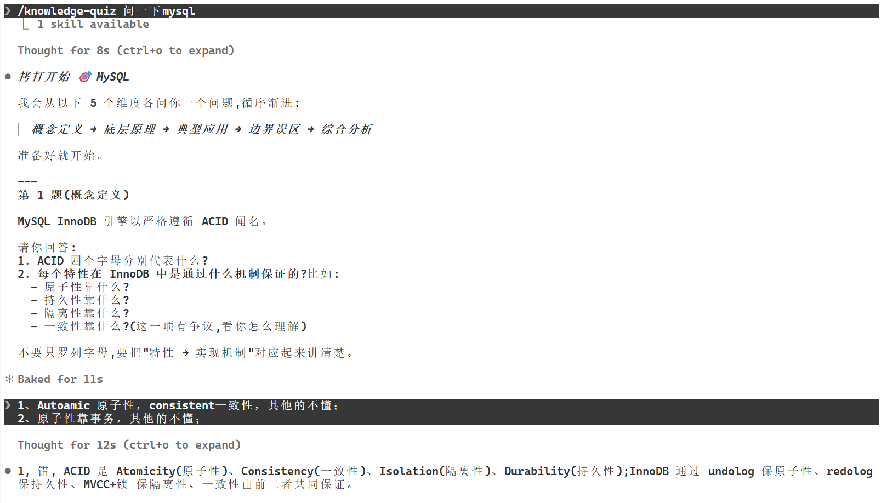

# Knowledge Quiz(知识点拷打)

> 用 5 个由浅入深的高质量问题检验你对任意技术知识点的掌握程度,错题自动归档成 Markdown,方便日后复习。
>
> Test your technical knowledge with 5 escalating questions. Wrong answers get auto-archived to Markdown for later review.


## 它能做什么

- 你说"拷打我 XXX",它会从 **概念定义 → 底层原理 → 典型应用 → 边界误区 → 综合分析** 五个维度各出一道题
- 每答一题,立即给出三选一的判定(对 / 半对半错 / 错)+ 一句话标准答案
- 5 题结束后,自动总结你的薄弱点,并把所有错题写入当前工作目录下的 `<知识点>.md`
- 没有引导式回复、没有评分表、没有废话,直接判定,不留情面

适合场景:面试前突击、学习完一门新技术后自测、想知道自己到底哪里还糊弄着。

## 环境要求

- 需要 [Claude Code](https://claude.com/product/claude-code) 或任何支持 `npx skills` 安装协议的 agent
- 不支持 Claude.ai 网页版、Anthropic API 直连调用
- 依赖 Node.js(`npx` 命令需要)

## 安装

通过 [`npx skills`](https://skills.sh/) 一行命令安装:

```bash
npx skills add Lzh-hub-theo/skills@knowledge-quiz
```

加 `-g` 安装到全局(用户级),`-y` 跳过确认:

```bash
npx skills add Lzh-hub-theo/skills@knowledge-quiz -g -y
```

## 使用

安装后,在 Claude Code 里直接说触发词就行,以下表达任选其一:

- `问问我关于 Docker`
- `考考我 React Hooks`
- `测一下我对 MySQL 索引的掌握`
- `拷打我分布式锁`

Claude 会先告诉你考察维度,然后开始第 1 题。一问一答,节奏不乱。

### 示例



## FAQ

**Q: 能自定义题目数量吗?**
A: 目前固定 5 题。想改的话编辑 `~/.claude/skills/knowledge-quiz/SKILL.md`,把第二步里的 `5` 全部替换即可。

**Q: 能改考察维度吗?**
A: 可以。`SKILL.md` 第一步列了 5 个维度(概念定义 / 底层原理 / 典型应用 / 边界误区 / 综合分析),增删或换名都行。

**Q: 错题归档可以改路径吗?**
A: 目前固定写入当前工作目录。如果想集中存放,跑 skill 前先 `cd` 到固定目录,或修改 `SKILL.md` 第三步的路径规则。

**Q: 能在 Claude.ai 网页版用吗?**
A: 不能。这个 skill 是 Claude Code 专用,没法上传到网页端。

**Q: 中途不想答了怎么办?**
A: 直接说"停止"或"换一个",已经问完的错题会被立即归档。

## 错题归档规则

- 归档路径:**当前工作目录** 下的 `<知识点>.md`
- 文件名:知识点中的非法字符(`/ \ : * ? " < > |`)会替换为下划线
- 只记录判定为"错"或"半对半错"的题目,答对的不写入
- 如果文件已存在,会在末尾追加,用 `---` 分隔

归档文件示例:

```markdown
# Docker 错题集

## 第 2 题

**题目**:Docker 是如何实现进程隔离的?

**用户回答**:用的是虚拟机。

**判定**:错

**标准答案**:Docker 通过 Linux 的 namespaces 实现进程隔离,
cgroups 实现资源限制,二者职责不同。

---
```

## 卸载

```bash
npx skills remove knowledge-quiz
```

或者直接删掉 `~/.claude/skills/knowledge-quiz/`(用户级)或 `.claude/skills/knowledge-quiz/`(项目级)。

## 仓库结构

```
.
├── knowledge-quiz/
│   └── SKILL.md          # skill 定义,符合 npx skills 规范
├── demo.png              # README 示例截图
├── .gitignore
├── LICENSE
└── README.md             # 本文件
```

`SKILL.md` 包含完整的 skill 行为定义(触发条件、流程、边界)。

## Contributing

欢迎提 issue / PR:
- 新增考察维度
- 优化提问模板
- 改进错题归档格式
- 修复 bug

## 关于这个项目

一位迷茫摆烂的草根针对求职面试而打造的拷问技能。希望它能帮你发现自己真正掌握的知识边界。

## License

[MIT](LICENSE) © 2026 Lzh-hub-theo